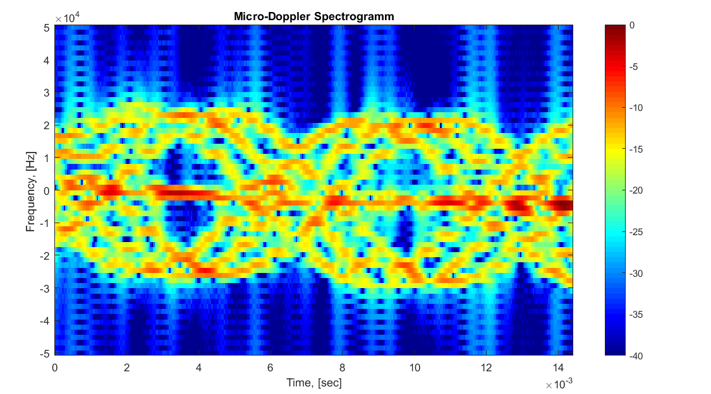
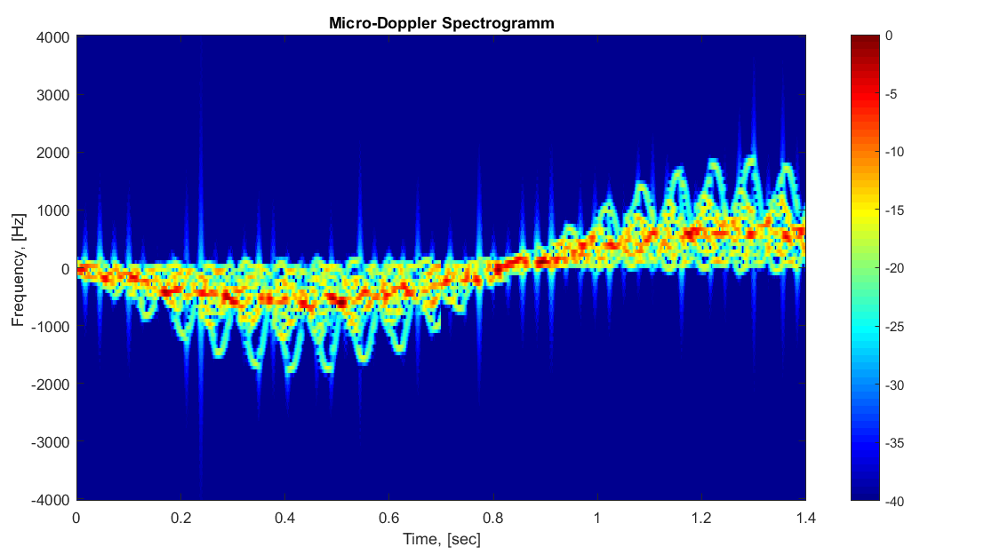

### Описание
Модель допплеровской модуляции радиолокационного сигнала при отражении от подвижной цели с множеством "блестящих точек".
Основная цель - получить вид допллеровской модуляции зондирующего сигнала.
Принятые упрощения:
- Цели заданы в виде совокупности блестящих точек с одинаковой ЭПР. Диаграмма рассеяния каждой из них изотропна.
- При определении амплитуды отраженного сигнала не принимается во внимание основное уравнение радиолокации.
#### Спектрограмма для дрона с тремя воздушными винтами
 

#### Спектрограмма для человека ростом 1.7 м, движущегося по окружности

### Cостав
(в программе использовались возможности ООП Matlab, поэтому файлы разделены на определения классов и скрипты с их использованием. Файлы классов
именуются с прописной буквы. )
+ complexTarget -	классы конктерных типов целей, наследники базового класса Target. движение составных частей описывается относительно начала их собственной системы кооринат.
  + TargetCopter - цель типа мулькоптера, может иметь переменное кол-во лопастей, их размер и скорость вращения.
  + TargetHelium - одиночная блестящя точка.
  + TargetHuman  - цель имитирует движение частей тела человека при ходьбе. [Ссылка на заимствованный код.](https://blogs.mathworks.com/cleve/2016/04/11/the-eigenwalker-model-of-the-human-gait/)
  + test_TagetCopter, test_TagetHelium, test_TagetHuman - тесты коректности движущихся целей.
+ main_scripts - главные скрипты. Настраивают и запускают симуляцию для конкрентых параметров работы. Параметры зондирования радара настроены в соответствие наблюдаемой целью. 
  + CopterTarget - модели мультикоптеров с разным числом лопостей.
  + HumanTarget - человек движущийся с постоянной скоростью прямо и по окружности.
  + SimpleTarget - простая цель с одной блестящей точкой, для сверки работы модели.
* radar - 
  * Radar - управляет передатчиком исходя из заданного разрешения по дальности и дистанции до цели.
  * Transmiter - отвечает за параметры радиоимпульса и моменты излучения
  * test_Radar - простой пример использования Radar c Transmiter.
* radarImaging - 
  * RadarImaging - модель межпериодной обработки накопленных зондирующих сигналов. Реализует контроль за накоплением пачек импульсов и считает их спектрограмму.
  * fftScale - выполняет Фурье преобразование и возвращает частотную шкалу.
  * stftFullSc - [вычисление оконного преобразования Фурье ](https://ch.mathworks.com/matlabcentral/fileexchange/45197-short-time-fourier-transformation--stft--with-matlab-implementation?focused=7566420&tab=function). Функция модифицирована и возвращает также отрицательный диапазон частот. Т.к. стандартные спектрограммы Matlab возващают только не отрицательные частоты комплектного сигнала. (отрицательные частоты, в смысле сдвиг фазы на pi).
  * test_stftFullSc - тест сравнивающий работу функций вычисления спектрограммы сигнала. (написанной самостоятельно и из Matlab)
* target - 
  * Target - базовый класс для конкретных целей из "complexTarget". Управляет перемещением и враением комплексных целей как единого целого.
* traceForm - набор траекторий движения.
  * TraceCircle - круговая траектория с вариируемыми радиусом и скоростью.
  * TraceReclinear - прямолинейная траектория с варьируемой скоростью и направлением
* visualization - функции для отображения 
  * setAxesPlan - настраивает отображения осей __Target Moving__
  * demoWindow - настраивает размеры и расположение осей отображения результатов
  
### Запуск модели:
  + все папки архива должны быть добавлены в путь поиска Matlab: main menu->home->envaronment->set path->add with subfolders
  + Версия Matlab 2016b и выше.
  + для изменения масштаба отображения цели используется переменная Lim в функции setAxesPlan

### Литература:
[The Micro-Doppler Effect in Radar](https://www.amazon.com/Micro-Doppler-Effect-Artech-Library-Sensing/dp/1608070573), Victor C. Chen, 2014
	
	
